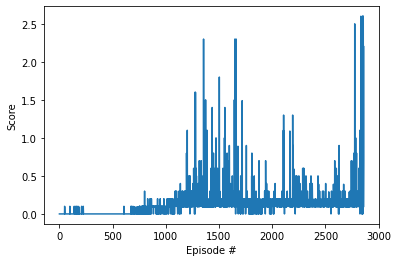

# Project report
Author: Mykhaylo Marfeychuk
## Learning algorithm
Actor-critic methods use two components, the actor which is a neural network which updates the policy and the critic which is another neural network which evaluates the policy being learned which is, in turn, used to train the actor. Generally the algorithm uses policy-based methods like REINFORCE, which uses a Monte-Carlo estimate and TD estimates.

Deep Deterministic Policy Gradient (DDPG) is a variation of the Actor Critic Methods. The actor produces a deterministic policy instead of the usual stochastic policy and the critic evaluates the deterministic policy. The critic is updated using the TD-error and the actor is trained using the deterministic policy gradient algorithm.

Multi-Agent Deep Deterministic Policy Gradient (MADDPG), uses seperate actors and critics for each agents and a shared memory buffer. The Group class, handles the multiple agents and it is not only restricted to dueling single agents, so it should work for more that two agents.

The solution is built on top of the DDPG implementation provided in the pendulum exercise, which was modified on the previous project. Each network in, actor and critic, have 2 fully-connected hidden layers layers with 128 neurons each.

Parameters used in MADDPG algorithm:

- Learning rate: 0.001
- Mini-batches: 256
- Replay Buffer: 100000
- Discount: 0.9
- Weight decay: 0.000001
- Sigma: 0.1
- Tau: 0.001

## Results



```
Episode 100	Average Score: 0.00
Episode 200	Average Score: 0.01
Episode 300	Average Score: 0.00
Episode 400	Average Score: 0.00
Episode 500	Average Score: 0.00
Episode 600	Average Score: 0.00
Episode 700	Average Score: 0.00
Episode 800	Average Score: 0.04
Episode 900	Average Score: 0.06
Episode 1000	Average Score: 0.08
Episode 1100	Average Score: 0.10
Episode 1200	Average Score: 0.15
Episode 1300	Average Score: 0.22
Episode 1400	Average Score: 0.22
Episode 1500	Average Score: 0.19
Episode 1600	Average Score: 0.22
Episode 1700	Average Score: 0.21
Episode 1800	Average Score: 0.14
Episode 1900	Average Score: 0.11
Episode 2000	Average Score: 0.14
Episode 2100	Average Score: 0.14
Episode 2200	Average Score: 0.19
Episode 2300	Average Score: 0.17
Episode 2400	Average Score: 0.14
Episode 2500	Average Score: 0.13
Episode 2600	Average Score: 0.15
Episode 2700	Average Score: 0.15
Episode 2800	Average Score: 0.19
Episode 2860	Average Score: 0.51
Environment solved in 2860 episodes!	Average Score: 0.51
```
## Ideas for future work

1. Automatic hyperparamter tuning
2. Shared network between actor and critic
3. PPO
